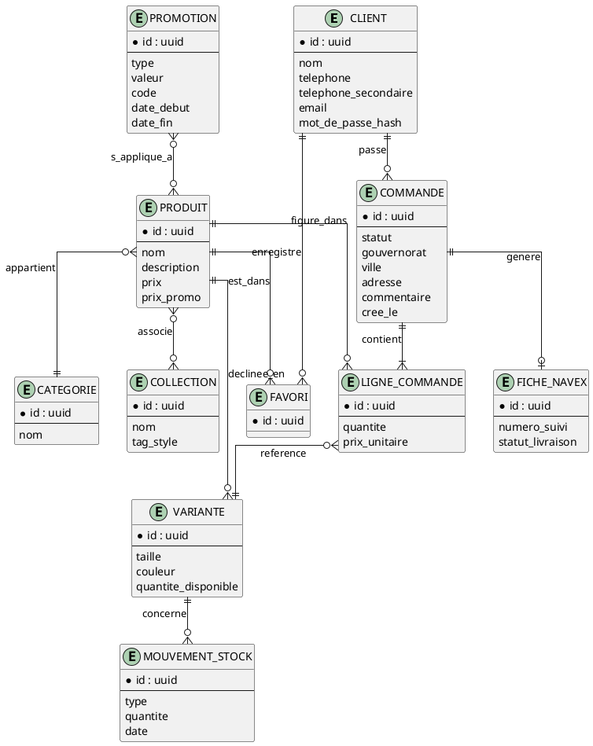
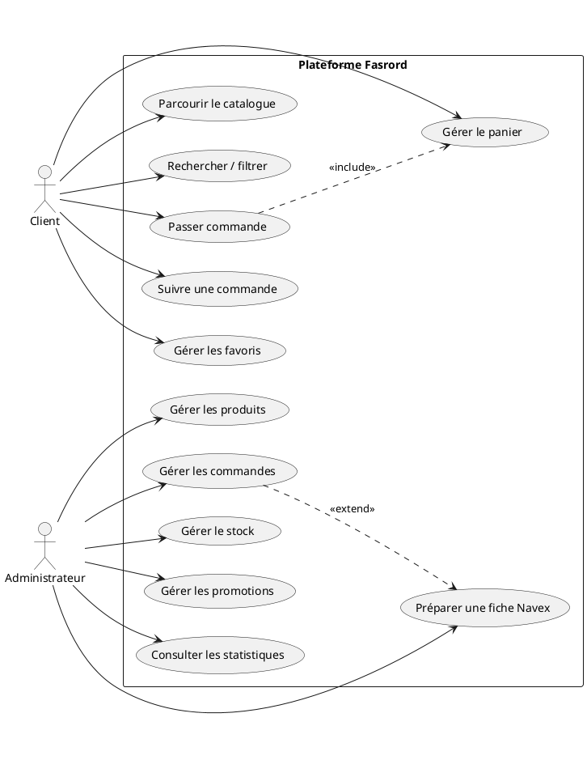
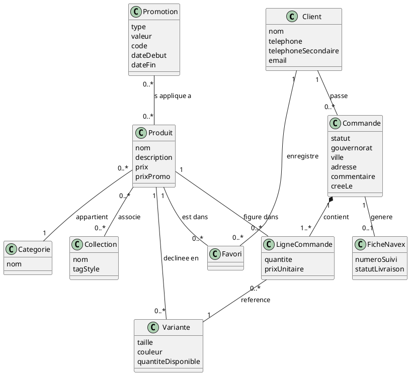
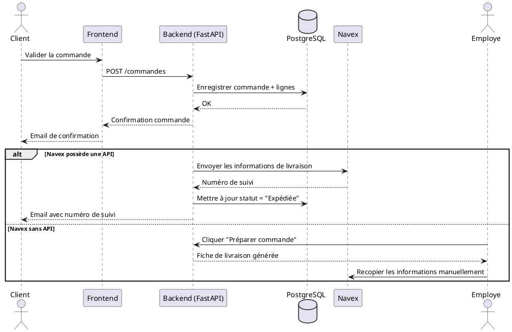
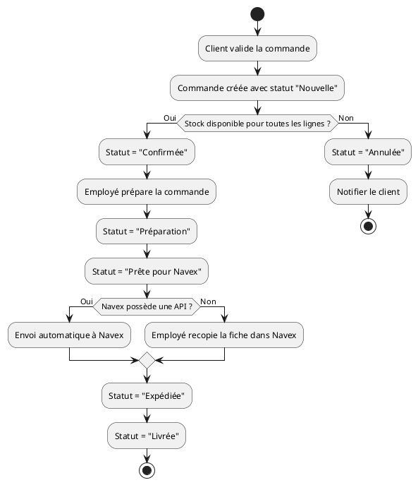
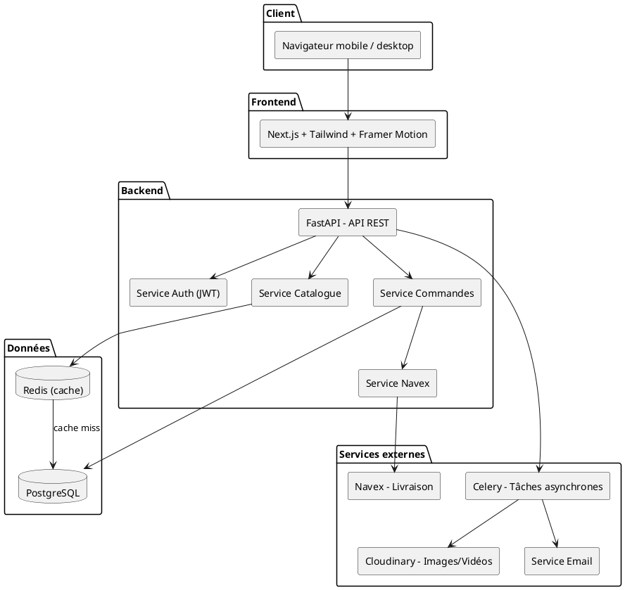

# Cahier des Charges — Plateforme E-commerce Fasrord

## 1. Présentation du projet

### 1.1 Contexte

Fasrord est une boutique de streetwear destinée principalement aux adolescents et jeunes adultes. Actuellement, les ventes sont réalisées exclusivement via Instagram.

Le processus actuel est entièrement manuel :

- Le client contacte la boutique via Instagram.
- Il envoie : nom, numéro de téléphone, deuxième numéro (optionnel), adresse, produits souhaités.
- Un employé saisit ces informations manuellement dans la plateforme Navex.
- Navex génère une fiche de livraison, imprimée puis collée sur le colis.
- Le colis est récupéré par Navex pour la livraison.

Ce processus présente plusieurs limites : temps de traitement élevé, risques d'erreurs de saisie, difficulté de suivi des commandes, gestion manuelle du stock, absence d'expérience d'achat moderne.

### 1.2 Objectif

Développer une plateforme e-commerce moderne permettant :

- la consultation des produits,
- la commande en ligne,
- la gestion du catalogue,
- la gestion des commandes,
- la génération des informations nécessaires à Navex,
- une expérience utilisateur alignée sur les codes du streetwear et de la génération Z.

### 1.3 Identité de marque

Fasrord se positionne comme une boutique de vêtements streetwear/sportwear, dans l'esprit Y2K, oversized, baggy, urban et basketball. L'identité n'est ni élégante ni luxueuse : elle est casual, tendance et proche de l'esthétique TikTok/Instagram.

> Fasrord est une boutique en ligne de vêtements streetwear, proposant des pièces oversized, Y2K et inspirées du sportwear pour adolescents et jeunes adultes. La plateforme vise à offrir une expérience d'achat moderne, inspirée des marques internationales, tout en restant adaptée au marché tunisien.

**Important — périmètre produit :** Fasrord vend exclusivement des vêtements (t-shirts, hoodies, shorts, jeans, ensembles, robes, etc.). La plateforme **ne vend ni chaussures, ni casquettes, ni sacs**. Toutes les fonctionnalités liées aux "looks", "tenues complètes" ou recommandations d'articles doivent donc se limiter aux catégories de vêtements réellement en stock.

## 2. Objectifs

### Pour les clients
- Parcourir les collections
- Voir les nouveautés
- Rechercher un article
- Filtrer les produits
- Ajouter au panier
- Passer commande
- Suivre l'état de la commande
- Recevoir des notifications

### Pour Fasrord
- Gérer les produits
- Gérer les tailles
- Gérer les couleurs
- Gérer les stocks
- Gérer les promotions
- Gérer les commandes
- Préparer les commandes Navex
- Consulter les statistiques

## 3. Utilisateurs

Deux types d'utilisateurs :

- **Client** : acheteur.
- **Administrateur** : personnel de Fasrord.

*(Un rôle Employé pourra être ajouté ultérieurement.)*

## 4. Fonctionnalités

### 4.1 Espace Client

**Authentification**
- Inscription
- Connexion
- Mot de passe oublié
- Profil utilisateur

**Catalogue produits**

Catégories (exemples) : T-shirts, Jeans, Shorts, Hoodies, Ensembles, Robes.

Collections thématiques, en complément des catégories classiques, pour un shopping par style plutôt que par simple type de vêtement :
- 🔥 Summer Drop
- 🏀 Basketball
- 💿 Y2K
- 🛹 Streetwear
- ⚡ Best Sellers
- ✨ New Drop
- ❤️ Girls / 🖤 Boys

**Recherche**

Recherche par nom, catégorie, couleur, taille, prix, **et par tags de style** (oversized, baggy, y2k, basketball, streetwear, summer, etc.) — plus naturel pour la clientèle cible que la recherche par nom exact.

**Filtres**
- Prix
- Taille
- Couleur
- Nouveautés
- Promotions

**Fiche produit**

Chaque produit contient : images multiples, nom, description, prix, prix promo, couleurs disponibles, tailles, quantité disponible, avis.

**Favoris ❤️**

Le client peut enregistrer des articles, avec alerte de retour en stock sur les articles épuisés.

**Panier**
- Ajouter / modifier quantité / supprimer
- Calcul automatique

**Commande**

Le client renseigne : nom, téléphone, téléphone secondaire, gouvernorat, ville, adresse, commentaire.

Mode de paiement : Paiement à la livraison (COD) pour le lancement.

**Historique**

Le client consulte ses commandes, leur statut et leur détail.

### 4.2 Administration

**Dashboard**

Statistiques : commandes du jour, chiffre d'affaires, produits vendus, commandes en attente, stock faible.

**Gestion produits** : CRUD complet (ajouter, modifier, supprimer).

**Gestion catégories et collections** : CRUD.

**Gestion promotions** : soldes, réductions, codes promo.

**Gestion des commandes**

Statuts : Nouvelle → Confirmée → Préparation → Prête pour Navex → Expédiée → Livrée (ou Annulée).

**Gestion stock** : entrées, sorties, alertes de rupture.

**Gestion utilisateurs** : clients, employés, administrateurs.

## 5. Fonctionnalités différenciantes (expérience Gen Z)

Ces fonctionnalités visent à rapprocher Fasrord de l'expérience proposée par Zara, Bershka, Pull&Bear ou SHEIN, en restant strictement dans le périmètre vêtements.

- 🎥 **Vidéos courtes** des vêtements portés, format Reels/TikTok.
- 👕 **"Complete the Fit"** : présenter des associations de vêtements complémentaires (ex. t-shirt + short + hoodie), au lieu du concept "Shop the Look" complet incluant accessoires. L'objectif reste d'ajouter plusieurs vêtements au panier en un clic, sans jamais suggérer d'articles hors catalogue (pas de chaussures, casquettes ou sacs).
- 🔥 Badges "Trending", "Best Seller", "New Drop".
- 📏 Guide des tailles interactif (vêtements uniquement).
- ❤️ Wishlist avec alerte de retour en stock.
- 📸 **"Seen on Instagram"** : chaque publication Instagram peut être associée aux vêtements qui y apparaissent. Le client clique sur une publication et retrouve directement les articles vestimentaires présentés, ajoutables au panier.
- 🎁 Compte à rebours pour les nouvelles collections ("Next Drop in 2 days").
- **Feed en page d'accueil** : alternance vidéo / photo / produit / vidéo, façon scroll Instagram, plutôt qu'une grille produit classique. Toute image ou vidéo cliquable ouvre la fiche du vêtement concerné.

## 6. Intégration Navex

Une étude préalable est nécessaire pour déterminer si Navex propose une API.

**Cas 1 — Navex possède une API**

Après validation de la commande, le site envoie automatiquement les informations à Navex, qui crée l'expédition et retourne un numéro de suivi consultable par le client. *(Solution idéale.)*

**Cas 2 — Navex ne possède pas d'API**

Les commandes arrivent dans le dashboard. L'employé clique sur "Préparer commande", une fiche est générée avec toutes les informations, puis recopiée dans Navex. Ce processus reste nettement plus rapide que le processus manuel actuel.

## 7. Notifications

**Par email** : confirmation de commande, expédition, livraison.

**Évolutions futures** : WhatsApp, SMS.

## 8. Responsive

Le site devra être compatible mobile, tablette et desktop. Plus de 90 % des clients Instagram achetant depuis leur téléphone, le design sera pensé **mobile-first**.

## 9. Architecture technique

### 9.1 Stack proposée

| Couche | Technologie |
|---|---|
| Frontend | Next.js, Tailwind CSS, Framer Motion (animations légères) |
| Backend | FastAPI, structure orientée services |
| Base de données | PostgreSQL, avec indexation et requêtes optimisées |
| Cache | Redis (pages d'accueil, listing produits, données fréquemment consultées) |
| Stockage images/vidéos | Cloudinary (ou service compatible S3) |
| Tâches asynchrones | Celery (traitement d'images, emails, futures notifications) |
| Authentification | JWT |
| Déploiement | Docker Compose |

### 9.2 Schéma de flux

```
Client
  │
  ▼
Next.js (Frontend)
  │
  ▼
FastAPI (Backend)
  │
  ▼
Redis (cache) ──── HIT ────► Réponse immédiate
  │
 MISS
  │
  ▼
PostgreSQL
  │
  ▼
Mise en cache dans Redis ──► Réponse au client
```

Les pages à fort trafic mais peu volatiles (page d'accueil, best-sellers, catégories, nouveautés, fiches produits) sont mises en cache dans Redis, ce qui évite de solliciter PostgreSQL à chaque requête et rend la navigation quasi instantanée.

### 9.3 Note sur la performance

Un ralentissement observé avec un faible volume de données (ex. une vingtaine d'enregistrements) n'est en général pas imputable à PostgreSQL lui-même — largement utilisé à grande échelle par des plateformes comme Instagram, Reddit, GitLab ou Notion — mais plutôt à des causes courantes : requêtes N+1, relations chargées de façon paresseuse (lazy loading), index manquants, ouverture d'une nouvelle connexion à chaque requête, jointures lourdes, requêtes exécutées en boucle, ou latence introduite par l'environnement d'exécution (ex. Docker sous WSL). L'architecture ci-dessus (cache Redis + indexation soignée + requêtes optimisées) est pensée pour éviter ces écueils dès la conception.

### 9.4 Paiement

- Lancement : paiement à la livraison (Cash On Delivery)
- Évolutions possibles : Flouci, Konnect, carte bancaire

## 10. Charte graphique

- Style streetwear / sportwear / Y2K / oversized / baggy / urbain
- Interface épurée, navigation intuitive
- Palette de couleurs inspirée de la marque
- Animations légères
- Photos et vidéos produits mises en valeur
- Expérience pensée pour les adolescents et jeunes adultes

## 11. Évolutions futures

- Application mobile React Native
- Programme de fidélité
- Wishlist partagée
- Notifications push
- IA pour recommander des articles (vêtements uniquement)
- Chat avec le support
- Gestion des retours
- Carte cadeau
- Multi-langue (Français / Arabe / Anglais)
- Multi-boutiques
- Tableau de bord marketing
- Intégration avec Meta (Instagram/Facebook Shop)

## 12. Démarche projet recommandée

Avant tout développement :

1. Cahier des charges (ce document)
2. Benchmark de sites comme Zara, Bershka, Pull&Bear, H&M et SHEIN
3. Maquettes UI/UX sur Figma (mobile puis desktop)
4. Modèle de données (MCD/ERD)
5. Cas d'utilisation et diagrammes UML
6. Architecture technique détaillée (frontend, backend, base de données, services externes)
7. Développement

Le point clé à clarifier en priorité reste l'intégration Navex : la présence ou non d'une API conditionne le niveau d'automatisation possible sur la gestion des expéditions.

Les livrables de cette phase de conception (benchmark, maquettes, modèle de données, diagrammes UML, architecture détaillée) sont présentés en annexe ci-dessous.

---

## Annexe A — Benchmark concurrentiel

Analyse de cinq acteurs du marché fast-fashion / streetwear, du point de vue UX mobile.

| Site / App | Ce qui fonctionne bien | Points faibles observés | À retenir pour Fasrord |
|---|---|---|---|
| **Zara** | Design épuré, esthétique haut de gamme, fonctionnalité de scan de code-barres en magasin | Navigation jugée confuse par plusieurs études UX : page d'accueil qui ouvre directement sur un produit sans contexte ni catégories, barre de recherche peu visible (pas d'icône loupe), incohérence entre la wishlist du site et celle de l'app | Toujours donner un point d'entrée clair (catégories/collections visibles dès l'accueil) ; une barre de recherche doit être identifiable immédiatement |
| **SHEIN** | Recommandations personnalisées selon le comportement de navigation, guide des tailles intégré, programme de points de fidélité (Shein Points) | Interface jugée surchargée par les retours utilisateurs, trop d'éléments visibles simultanément | Le feed façon Instagram doit rester aéré : un contenu à la fois (vidéo, photo ou produit), pas une grille dense |
| **Pull&Bear** | Fonctionnalité "PBShuffle" : vidéos courtes permettant de découvrir et acheter des tenues directement depuis un contenu inspirationnel ; wishlist mise en avant comme fonctionnalité la plus utilisée | Bugs de synchronisation de wishlist rapportés par les utilisateurs (articles perdus après reconnexion), limite trop basse sur le nombre d'articles en wishlist | Confirme la pertinence du concept vidéo → achat direct (aligné avec "Seen on Instagram") ; la wishlist doit être fiable et sans limite artificielle |
| **Bershka** | Catalogue complet avec constitution de tenues complètes, géolocalisation des points de vente | — | La logique "choisir des articles et composer une tenue" confirme l'intérêt de la fonctionnalité "Complete the fit" |
| **H&M** | Gamification poussée : programme de fidélité à paliers (statut "Plus" débloqué par l'accumulation de points), quiz de style et compositeur de tenues interactif | — | Les mécaniques de fidélité par paliers et le questionnaire de style sont de bons candidats pour les évolutions futures (section 11) |

**Constat général** : les études UX indépendantes sur Zara et Pull&Bear pointent régulièrement les mêmes irritants : recherche peu visible, wishlist peu fiable, page d'accueil sans repères. Fasrord peut se différencier en évitant ces trois écueils dès la conception : recherche toujours visible avec icône explicite, wishlist stable, page d'accueil avec collections identifiables même dans un format feed.

## Annexe B — Maquette UI/UX (mobile-first)

Une première maquette de la page d'accueil mobile a été produite (voir le rendu affiché plus haut dans la conversation), illustrant :

- Barre supérieure avec recherche et wishlist toujours visibles (pour répondre directement aux irritants identifiés dans le benchmark),
- Chips de collections (New drop, Streetwear, Y2K, Basketball) juste sous le header,
- Bandeau compte à rebours "Next Drop",
- Bloc vidéo (Trending) en grand format façon Reels,
- Rail horizontal "Complete the fit" présentant des vêtements complémentaires,
- Grille "Seen on Instagram" en bas de flux,
- Navigation basse à 4 onglets (Accueil, Catégories, Favoris, Profil).

La version desktop reprendra la même hiérarchie de contenu (feed → collections → complete the fit → seen on Instagram) en 2-3 colonnes plutôt qu'en défilement vertical unique, avec la barre de recherche et le panier fixés en haut de page. Une itération Figma complète (desktop, fiche produit, panier, tunnel de commande) pourra être livrée dans un second temps une fois la direction artistique validée.

## Annexe C — Modèle de données (MCD/ERD)

Le modèle conceptuel de données a été formalisé sous forme d'ERD (voir le diagramme affiché plus haut dans la conversation). Points clés :

- **PRODUIT** ne porte pas directement la taille/couleur/stock : ces informations sont déportées dans **VARIANTE** (une ligne par combinaison taille × couleur), ce qui permet une gestion de stock précise par déclinaison.
- **COLLECTION** est distincte de **CATEGORIE** : une catégorie est un type de vêtement (T-shirt, Short...), une collection est un regroupement thématique (Summer Drop, Y2K...). La relation Produit ↔ Collection est many-to-many.
- **COMMANDE** se décompose en **LIGNE_COMMANDE** (une ligne par variante commandée), et génère au plus une **FICHE_NAVEX** une fois prête pour expédition.
- **FAVORI** est une table d'association Client ↔ Produit, indépendante du panier.
- **MOUVEMENT_STOCK** trace les entrées/sorties de stock par variante, pour l'historique et les alertes de rupture.

Équivalent textuel (PlantUML, pour import direct dans un outil de modélisation) :



## Annexe D — Diagrammes UML

Conventions appliquées (cohérentes avec les standards déjà utilisés sur InvisiThreat) : pattern BCE pour le cas d'utilisation, `skinparam conditionStyle inside` pour les diagrammes d'activité, branches explicitement labellisées Oui/Non, et aucun attribut de clé étrangère dans le diagramme de classes — uniquement des associations UML explicites.

### D.1 Diagramme de cas d'utilisation



### D.2 Diagramme de classes (extrait)



### D.3 Diagramme de séquence — Passer commande (avec cas Navex API / sans API)



### D.4 Diagramme d'activité — Cycle de vie d'une commande



## Annexe E — Architecture technique détaillée

### E.1 Composants



### E.2 Détail par couche

| Couche | Responsabilité | Points d'attention |
|---|---|---|
| Frontend (Next.js) | Rendu du feed, catalogue, panier, tunnel de commande | Rendu mobile-first, images en lazy-loading, pré-rendu des pages catégories pour le SEO |
| API (FastAPI) | Exposition des endpoints REST, validation des données, orchestration des services | Structure en services séparés (auth, catalogue, commandes, Navex) pour rester modulaire |
| PostgreSQL | Source de vérité (produits, variantes, commandes, utilisateurs) | Index sur les colonnes de recherche/filtre (catégorie, prix, tags), éviter les requêtes N+1 via un chargement explicite des relations |
| Redis | Cache des pages à fort trafic (accueil, catégories, best-sellers) | Invalidation du cache à chaque mise à jour produit/stock |
| Celery + Redis (broker) | Traitement asynchrone : redimensionnement d'images, envoi d'emails, génération de fiches Navex | Découpler ces tâches de la requête HTTP principale pour ne pas ralentir la réponse au client |
| Cloudinary | Stockage et transformation des images/vidéos produits | Formats optimisés automatiquement pour mobile |
| Navex | Génération d'expédition et suivi | Intégration conditionnée à l'étude préalable (section 6) |

Cette architecture reprend directement les briques déjà maîtrisées sur InvisiThreat (FastAPI, PostgreSQL, Redis, Celery, Docker), ce qui réduit le risque technique et permet de concentrer l'effort de conception sur l'expérience utilisateur, différenciante pour Fasrord.
